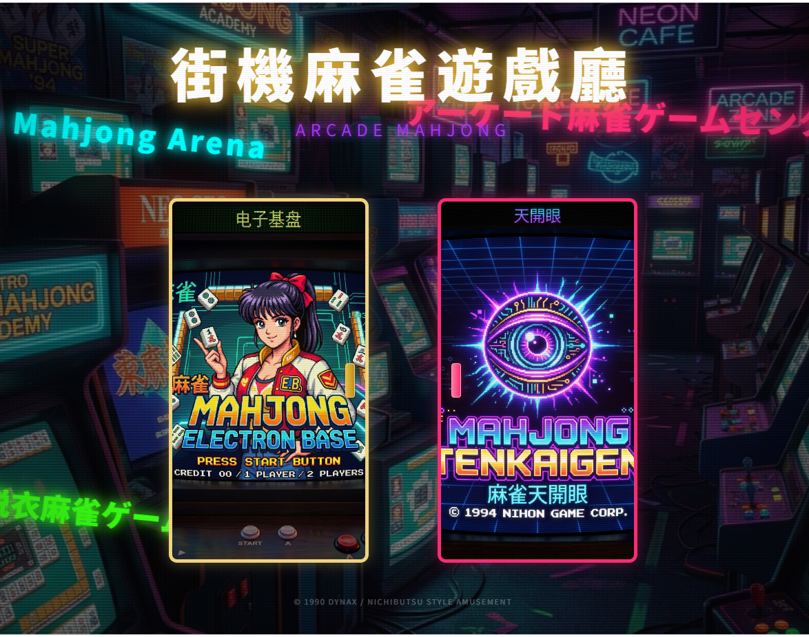
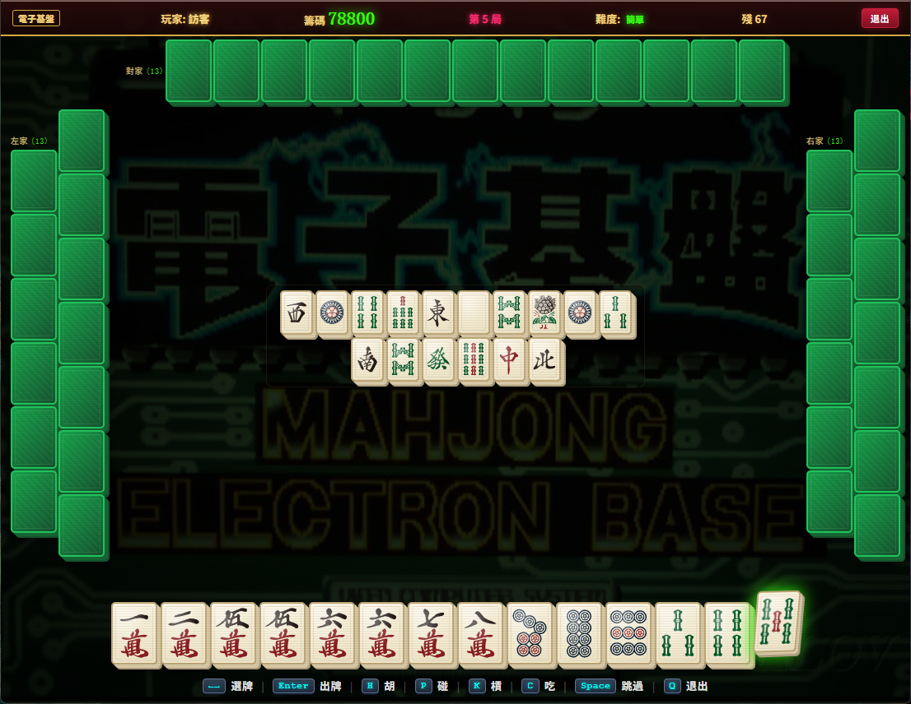
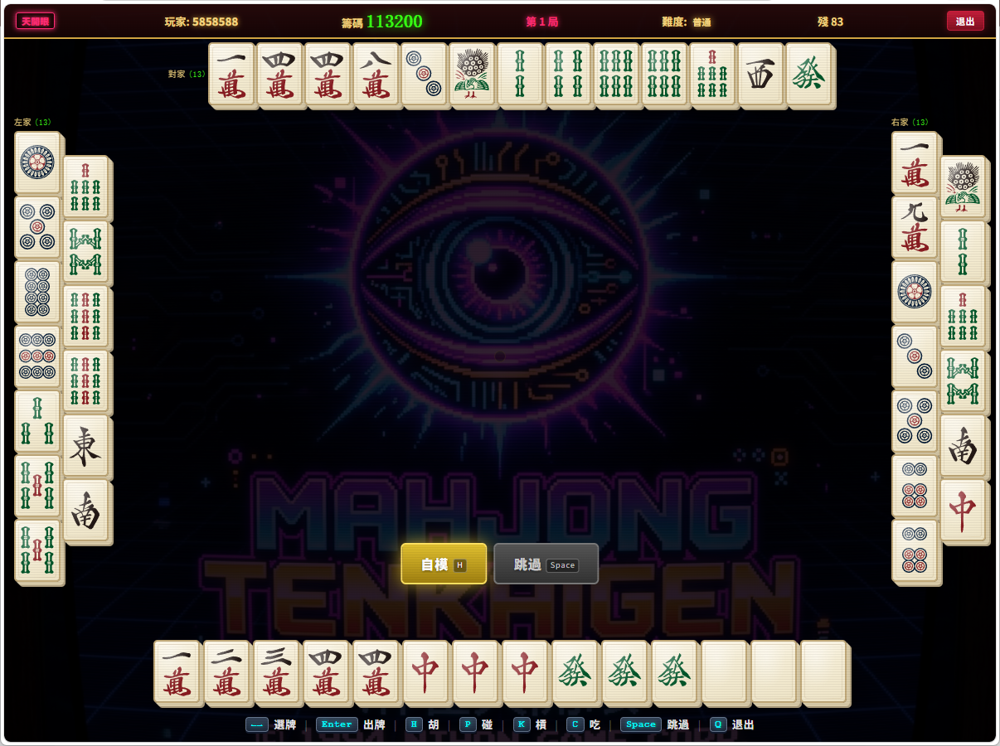
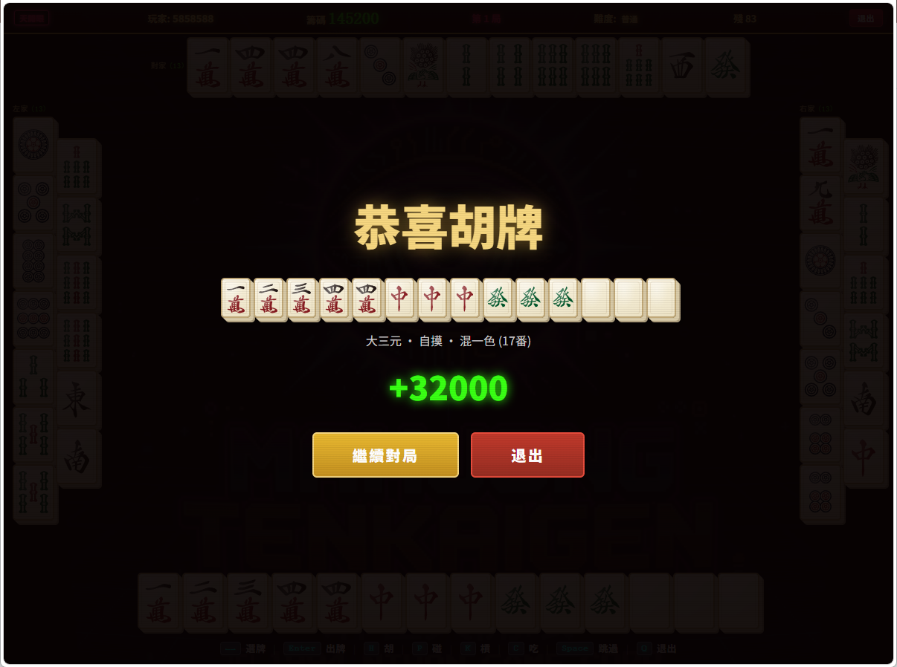
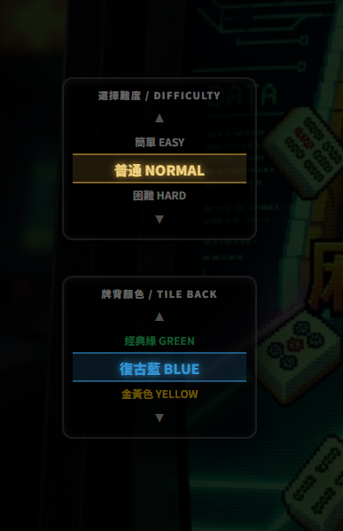
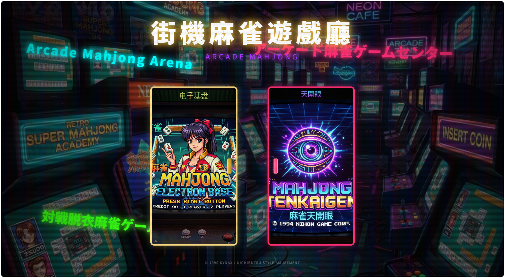

# Arcade Mahjong 90s (街機麻將 de 90s)

## What is Mahjong
    Julia Roberts is an avid [Mahjong](https://en.wikipedia.org/wiki/Mahjong) player who uses the tile-based game as a weekly ritual to relax, bond with friends, and find philosophical meaning. She views the game as a beautiful metaphor for life, famously stating, "The concept of it is to create order out of chaos based on random drawing of tiles." Check this out: [The Late Show with Stephen Colbert](https://www.youtube.com/watch?v=Wb_T0FS2IRs)


----
## Arcade Mahjong 90s - Simulator Game
A modern, web-based recreation of the classic 1990s street arcade mahjong machines (based on electronic kiban/electronic boards like *Electronic Base* and *Daimangan* by Dynax, Capcom, and IGS).

This game features the iconic dark red and gold cabinet visuals, golden neon glowing headings, custom 3D card tilt physics via Vanilla CSS, and computer AI players—fully modernized with local SVG rendering, next-generation responsive rendering, and local database persistence.

---

## 📸 Game Interface Preview

Here are some screenshots showcasing the interface, gameplay modes, and custom features of the game:

### 1. Main Lobby Portal Screen


### 2. Electronic Board (電子基盤) Mode


### 3. Tian Kai Yan (天開眼) Mode


### 4. Winning Hand Showcase (胡牌)


### 5. Start Screen Option Selector & 3D Drum Wheels


### 6. Nostalgic Read Me (讀我) Page


### 7. Complete Overview


---

## 🎮 Game Features
- **4-Player Local Game**: 1 human player vs. 3 responsive computer AI players.
- **Traditional Tileset**: 136 standard Japanese mahjong tiles (Characters, Dots, Bamboo, Winds, and Dragons).
- **Standard Hand Combinations (Yaku)**:断幺九, 平和, 自摸, 對對胡, 混一色, 清一色, 字一色, and 七對子.
- **Full Declarations**: Support for Chow (吃), Pong (碰), Mingkan/Ankan (明槓/暗槓), and Ron/Tsumo (榮和/自摸).
- **Responsive 3D Board**: Cards display ivory texture gradients, physical card dimensions, shadow parameters, and tilt effects on hover/selection.
- **Arcade Chip persistency**: Starts with 10,000 chips. Scores are saved locally. When chips run out, players can insert virtual coins to top-up.

---

## 🛠️ Technology Stack
- **Frontend Framework**: Next.js 15 (React 19, App Router)
- **Database Layer**: SQLite3 database (`better-sqlite3`) for anonymous session scoring, game history logging, and stats persistence.
- **Visuals & 3D Render**: Vanilla CSS (using native 3D CSS Transforms, perspective projections, keyframe animations, and HSL palettes).
- **Asset Pipeline**: Static local SVG vectors (preloaded and cleaned dynamically in JavaScript to overlay our CSS 3D ivory gradients).
- **Automation Hook**: Git pre-commit script for automated package version bumping (`m.n.p` wrapping at 9) and build date recording.

---

## ⌨️ Controls & Shortcuts

| Action | Keyboard Key | Mouse Click |
| :--- | :--- | :--- |
| **Select Card** | `←` or `→` (Left/Right Arrows) | Hover over cards |
| **Discard Card** | `Enter` | Click on selected card |
| **Hu (Win)** | `H` | Click `胡牌` / `自模` |
| **Pon (Pong)** | `P` | Click `碰` |
| **Kan (Kong)** | `K` | Click `槓` |
| **Chi (Chow)** | `C` | Click `吃` |
| **Skip / Pass** | `Spacebar` | Click `跳過` |

---

## 🚀 Getting Started

### Prerequisites
Make sure you have Node.js (v18+) and npm installed.

### Setup & Run
1. Clone the repository and navigate into the folder:
   ```bash
   git clone https://github.com/marcuz-apl/Mahjong-90s.git
   cd Mahjong-90s
   ```
2. Install dependencies:
   ```bash
   npm install
   ```
3. Run the local development server:
   ```bash
   npm run dev
   ```
4. Open your browser and head to:
   ```
   http://localhost:3000
   ```
5. Click **"投幣開始"** (Insert Coin to Start) to load the assets and start playing!

---

## 👏 Credits
- Mahjong Tile Vectors files: https://github.com/lietxia/mahjong_graphic

---

## 📄 License
This project is licensed under the **Apache License 2.0**.

```
Copyright 2026 marcuz-apl

Licensed under the Apache License, Version 2.0 (the "License");
you may not use this file except in compliance with the License.
You may obtain a copy of the License at

    http://www.apache.org/licenses/LICENSE-2.0

Unless required by applicable law or agreed to in writing, software
distributed under the License is distributed on an "AS IS" BASIS,
WITHOUT WARRANTIES OR CONDITIONS OF ANY KIND, either express or implied.
See the License for the specific language governing permissions and
limitations under the License.
```
